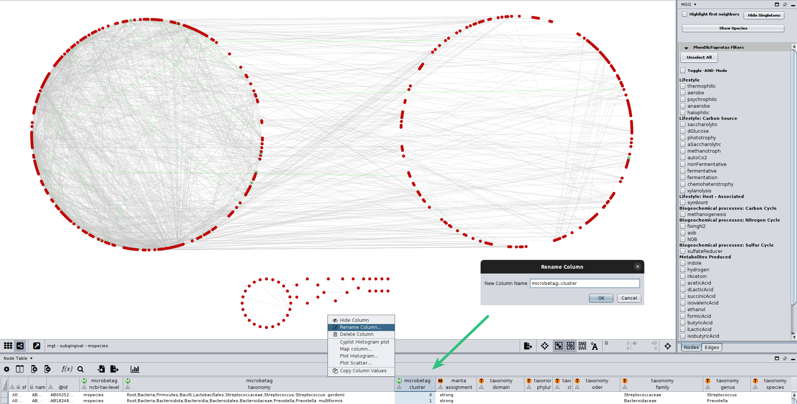
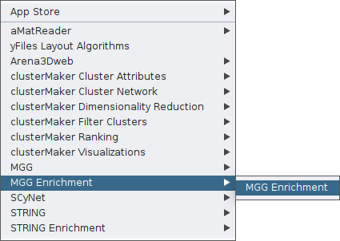
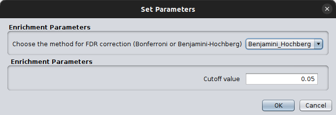
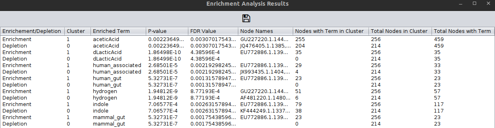

Enrichment analysis 
===================

The `MGG` Cytoscape App of ours enables enrichment/depletion analysis of the `microbetag` annotated network 
at the nodes level. 
This means that you can test whether the nodes (taxa) of a cluster are enriched with phenotypic traits assigned to them based on
[phendb models](../modules/phen-traits.md), and or [FAPROTAX](../modules/faprotax-functions.md).

In this tutorial, we use the *microbetag*-annotated network derived from the example case for [running *microbetag* with big datasets](../advanced_use/large_data.md) that makes use of the Qiita publically available dataset from the [HMP](https://qiita.ucsd.edu/study/description/1928).


After performing `microbetag` having enabled the network clustering step (using `manta`), we ended up with a network that 
besides the FAPROTAX and phenDB-like annotations, it also splits its nodes to 2 big clusters.


In the figure above, all nodes on the *left "circle"* have been assigned to cluster `0` while all those on the *right "circle* and those 
below them, have been assigned to cluster `1`.

Through `MGG` we may check/uncheck one or more of their annotations. For example, by clicking on the `symbiont` box, one can see which nodes have been annotated with this term across the network:


However, we need **statistics** to check whether a cluster has more nodes (taxa) annotated with a trait compared to the other ones.


In the `Nodes table` of Cytoscape, you can find its corresponding column, called `manta::cluster`.


```{note}
[`manta`](https://github.com/ramellose/manta) uses a diffusion-based proccess to carry out network clustering, and you may find 
more on how it works and its findings at this [demo case](https://ramellose.github.io/manta/demo_manta.html). 
However, there is a great range of network clustering algorithms you could go for. 
In all cases, once you cluster your network, each node will be assigned to a cluster. 
Several clustering results can be applied to the same network.
Apparently though, **only one at a time** can be used for the enrichment/depletion test.
```


To proceed to the `MGG` enrichment/depletion analysis, you need to **rename** your cluster-assigned column so it is under the `microbetag` namespace.
For example, assuming you wish to use the `manta` clusters as returned from running `microbetag`, you would rename the `manta::cluster` column (as shown in the figure above), to `microbetag::cluster`. 




Now, by clicking again on the `Apps` tab, you may use the `MGG Enrichment` feature. 

 

`MGG` supports two approaches for calculating the False Discovery Rate:
- [Bonferroni](): more conservative, reducing false positives but increases false negatives ( $\frac {\alpha} {m}$, where $\alpha$ is the required
  significance level, and $m$ the number of total tests. 
  Example: if you perform 100 tests, and you have a threshold of 0.05, then only tests with a p-value $\leq 0.05/100 = 0.0005$ will be considered significant.  <!-- family wise error rate actually not fdr -->
- [Benjamini - Hochberg](): less conservative, best for explorative analyses. It ranks the p-values and then adjusts the p-value by applying:
    $ p_{adj} = p_i * \frac{m}{rank(i)}  $. Thus, it may allow some false positives, but allows more discoveries while controlling the expected proportion of false positives.




After setting which static to use, you can fire the enrichment/depletion test by clicking `Ok`. This will return a pop-up table 




<!-- <script src="_static/lightbox2/dist/js/lightbox-plus-jquery.min.js"></script> -->

