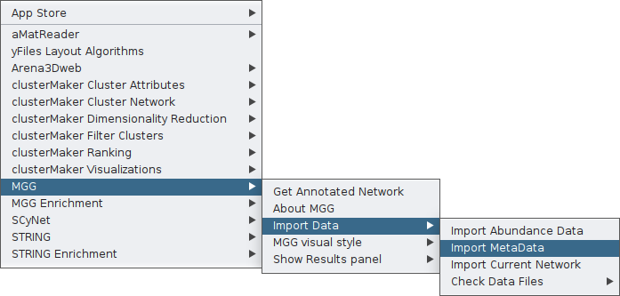
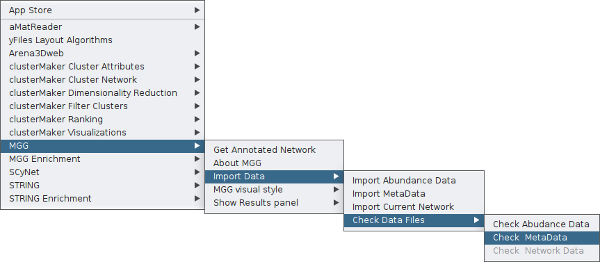
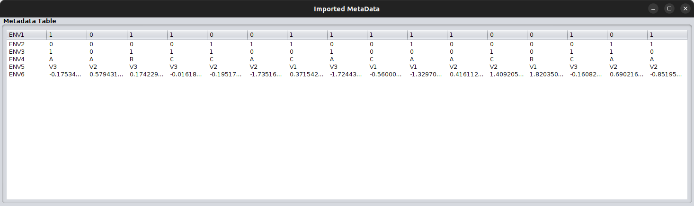

## .. starting from an abundance table and a metadata file

In this case, you follow the exact steps as in the previous scenario and once you have loaded your abundance table, you import also the one with your metadata. 

You can check the metadata file, similar to how you check the abundance data, through the `MGG` menu:

{: important}
Your metadata need to be as rows having their values per sample in their columns. See also on the [input files](./input.md#metadata-file) section. 

{: .warning}
Remember to set the parameters as in the [previous example](abd_only.md), i.e. your taxonomy is Silva and FlashWeave needs to run using the `sensitive` approach. 

Here is the annotated network returned:

